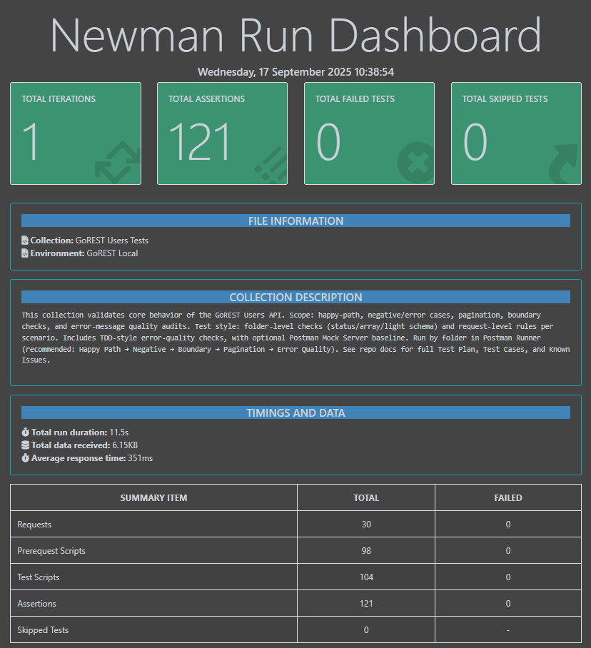

# GoREST – Users API Tests (Postman)

[](https://github.com/yoavmosco/gorest-users-tests/actions/workflows/newman.yml)

Tests for GoREST **Users** API focusing on happy-path, negative, pagination (strict), boundary, and error-message quality.

## What’s covered
- Folder-level checks (status / array / light schema).
- Request-level assertions for each scenario under `/users`.
- **Pagination (strict)**:
  - Page 2 has **no overlap** with Page 1 (0 shared IDs).
  - Invalid `page` (e.g. `-1`) returns the **same item set** as Page 1 (order-agnostic).
- **Error quality audits**: verify clarity for 4xx (duplicate email, invalid enums).

## How to run (Postman UI)
1. Import collection: `postman/GoREST Users Tests.postman_collection.json`
2. Import environment: `postman/env/GoREST Local.postman_environment.json`
3. **Set environment variables:**
   - `token` → insert your personal GoREST API token (never commit it to Git).
   - `mockBaseUrl` → insert your own Postman Mock Server URL (see [Mock-based TDD](#mock-based-tdd-postman-mock-server)).
   - `baseUrl` is already preconfigured in the environment file.
4. Run folders:
   - Pagination: run page=1 → page=2 → invalid.
   - Negative / Email: **Seed (201)** → **Duplicate (422)** → **Cleanup (204)**.
   - Other 422 tests (missing/invalid format) are independent.

## How to run (Newman CLI)
This project also includes a ready-to-run Newman setup.

### Prerequisites
- [Node.js](https://nodejs.org/) (v16+)
- Run `npm install` in the project root to install `newman` and `newman-reporter-htmlextra`.

### Run Locally
Runs the collection with your local **secret** environment and generates an HTML report:

```bash
npm run test:api
```
> Note: make sure to provide your own valid values in the environment file (`postman/env/GoREST Local.postman_environment.json`) before running:
> - `token` → your personal GoREST API token
> - `mockBaseUrl` → your Postman Mock Server URL

### Running specific folders
Useful when you want to run only a subset (e.g., skip mocks):
```bash
npx newman run "postman/collection/GoREST Users Tests.postman_collection.json" \
  -e "postman/env/GoREST Local.postman_environment.json" \
  --folder "Pagination" \
  --folder "Negative"
```

### Fail-fast (bail)  
Stop early when failures occur:

```bash
# Stop on the first failing request/test
npx newman run "postman/collection/GoREST Users Tests.postman_collection.json" \
  -e "postman/env/GoREST Local.postman_environment.json" \
  --bail
```

```bash
# Stop when the first folder fails (continue within a folder, but stop when a folder overall fails)
npx newman run "postman/collection/GoREST Users Tests.postman_collection.json" \
  -e "postman/env/GoREST Local.postman_environment.json" \
  --bail folder
```

### npm scripts
For convenience, the project defines two ready-to-run npm scripts:

- `npm run test:api` → full run with HTML report (htmlextra).
- `npm run test:smoke` → quick “smoke run” of core folders (Happy Path, Negative, Boundary, Pagination), skipping mocks, with `--bail`.

> These are defined in `package.json` under `"scripts"`, so anyone can run them without remembering long Newman commands.

## Run with Docker (no local Node required)

Build the image once:

```bash
docker build -t gorest-tests .
```

Run (PowerShell on Windows):

```powershell
docker run --rm `
  -e TOKEN="YOUR_GOREST_TOKEN" `
  -e MOCK_BASE_URL="https://<your-mock-id>.mock.pstmn.io" `
  -v "${PWD}\reports:/app/reports" `
  gorest-tests
```

Run (macOS/Linux/Git Bash):

```bash
docker run --rm   -e TOKEN="YOUR_GOREST_TOKEN"   -e MOCK_BASE_URL="https://<your-mock-id>.mock.pstmn.io"   -v "$PWD/reports:/app/reports"   gorest-tests
```

## CI – GitHub Actions (Newman)
Status: 

On every push/PR to `main`, the workflow runs `newman` with HTML and JUnit reports:
- Secrets used: `GOREST_TOKEN` (GoREST API token), `MOCK_BASE_URL` (Postman Mock URL).
- Artifacts: `newman-reports` → contains `reports/newman.html` and `reports/junit.xml`.

**How to download reports:**  
Go to **Actions → Newman API tests → latest run → Artifacts → newman-reports** and download the ZIP.

### Report preview


## Challenges & solutions
- **Schema failed on 404**  
  *Fix:* schema guard — run only on **2xx JSON**. For the delete-verify step, assert **404 + message** without schema.
- **Duplicate email stability**  
  *Problem:* pre-request seeding was async → sometimes got `201` instead of `422`.  
  *Fix:* deterministic flow **Seed → Duplicate (422) → Cleanup (204)**.

### Error quality as TDD
Assertions for **clear error messages** and correct **4xx codes** are written first and then used as **TDD** until the behavior matches.  
Example focus: duplicate email (422), invalid enums, missing required fields.

## Mock-based TDD (Postman Mock Server)
Following the section above, this mock server was created to demonstrate the TDD approach for invalid error messages, specifically showing the desired fix for invalid `status` messages.

**Folder:** `Users / Error Quality – Mock Server (TDD)`  
**How it works:**
- `DEF: POST /users — invalid status (422 example only)` holds a 422 Example used by the mock (do **not** run it).  
- Runnable requests:  
  - `MOCK: invalid status (string)`  
  - `MOCK: invalid status (number)`  
  These call `{{mockBaseUrl}}/users` with invalid values and always assert the **STRICT** message:  
  ```json
  [
    {
      "field": "status",
      "message": "status is invalid; must be one of: active, inactive"
    }
  ]

**Environment:** add `mockBaseUrl = https://<your-mock-id>.mock.pstmn.io` (No Auth required for the mock).

## Repo structure
```
postman/
├─ GoREST Users Tests.postman_collection.json
└─ env/
   └─ GoREST Local.postman_environment.json
test-plan/
└─ TEST_PLAN.md
test-cases/
└─ TEST_CASES.md
findings/
└─ KNOWN_ISSUES.md
```

## Known issues / Findings
| ID  | Title                                | Type            | Repro (high level)                 | Expected               | Actual                 | Status/Notes                        |
|-----|--------------------------------------|-----------------|-----------------------------------|------------------------|------------------------|------------------------------------- |
| K1  | Invalid `page` falls back to Page 1  | Finding         | GET `/users?page=-1` after Page 1 | Error or explicit empty | Same item set as Page 1 | Covered by strict compare test      |
| K2  | Error messages for invalid enums can be vague | Potential issue | POST `/users` with `status=123` | “must be one of …”     | “can’t be blank”       | Using error-quality tests as TDD    |

## Documentation
- [Summary](SUMMARY.md)
- [Test Plan](test-plan/TEST_PLAN.md)
- [Test Cases](test-cases/TEST_CASES.md)
- [Known Issues](findings/KNOWN_ISSUES.md)
